<!-- _class: title -->

# Linux Distributions
## Expedition into the linux distro jungle

---

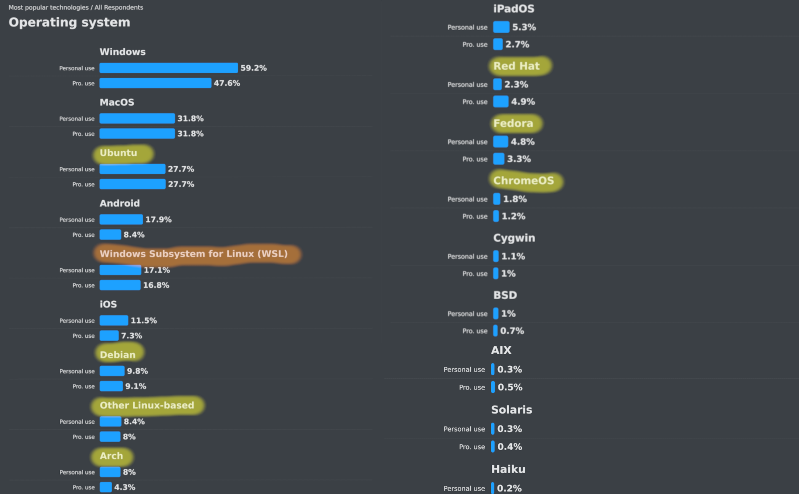

---

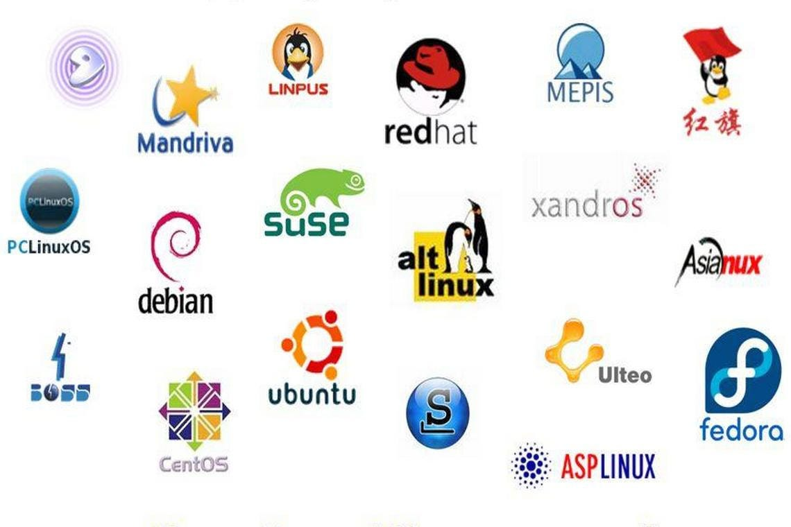

---

<!-- header: 'Was ist eine Distribution?' -->

- Linux Geschmacksrichtung
- Kernel Gemeinsam
- Der rest ist austauschbar
- Fokus: user-friendly, user-centric, commercial

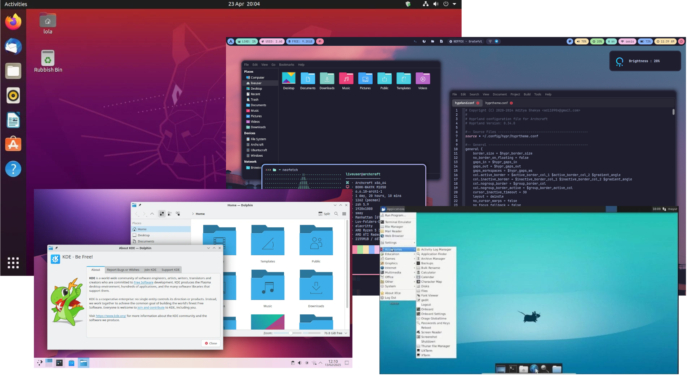

<!-- Maßgenschneiderte version von linux - sammlung von packeten + configs-->

---

<!-- header: 'Package Managers' -->

- Package managers
  - dpkg
  - Pacman
  - Portage
  - Nix package manager
  - Snap
  - ...

- Repositories

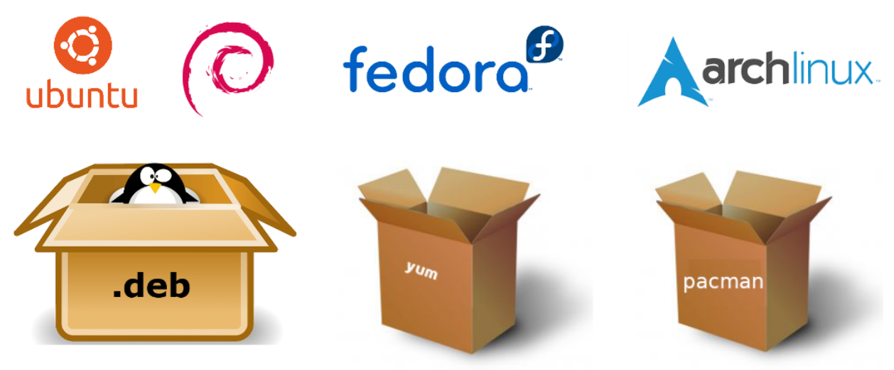

---

<!-- header: '' -->

---

<!-- header: 'Debian-Based' -->

# **Debian (1993)**
  - Package manager: **dpkg** (APT)
  - Repositories:
  - 2GB / 10 GB (Desktop/!Desktop)

---

<!-- header: 'Debian-Based' -->
# **Ubuntu (2004)**
- Einsteigerfreundlich
- Desktop / Server / Core
- Package manager: **dpkg** (APT), Snap

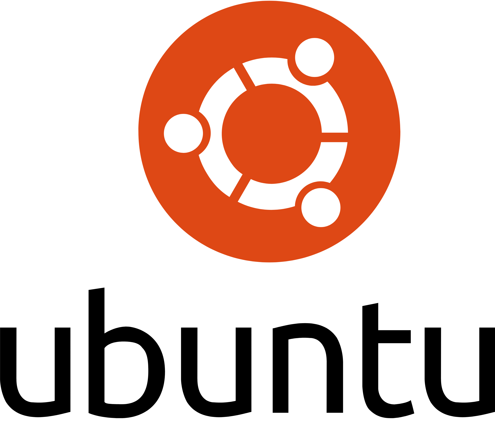

---

<!-- header: 'Arch-Based' -->
# **Arch Linux (2002)**
- Rolling Release: Immer aktuell
- Minimalistische Distro
- Package manager: **pacman** (AUR)
- Alles wird selbst installiert und konfiguriert

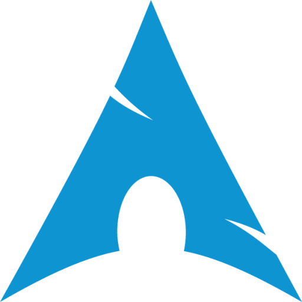

---

<!-- header: 'Arch-Based' -->
# **EndeavourOS (2019)**
- Komfortabler Installer
- Minimalistische Distro
- Package manager: **pacman** (AUR)
- Community-driven

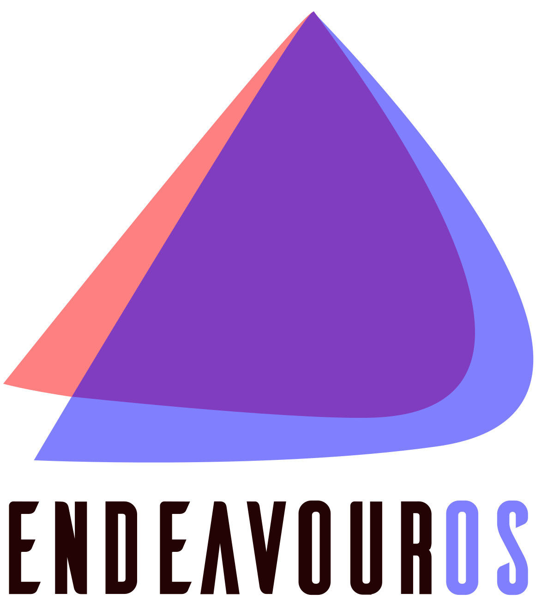

---

<!-- header: 'Arch-Based' -->
# **SteamOS**
- Fokus: **Gaming**
- Entwickelt von Valve
- Steam Deck

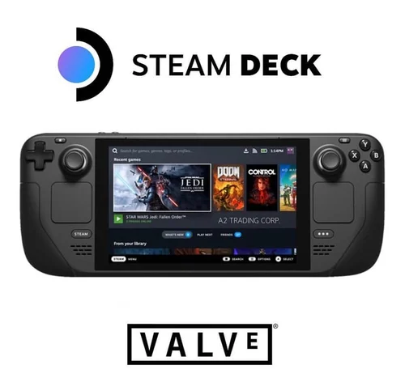

---

<!-- header: 'Fedora' -->
# **Fedora (2003)**
- Gesponsert von Red Hat
- Sehr aktuell, experimentell
- Package manager: **dnf**
- Fokus: Entwickler und neue Technologien

---

<!-- header: 'Other Major Distros' -->
# **openSUSE (2005)**
- Zielgruppe: Entwickler und Unternehmen
- Varianten: Leap (stabil) & Tumbleweed (Rolling Release)
- Konfigurationswerkzeug: **YaST**
- Package manager: **zypper**

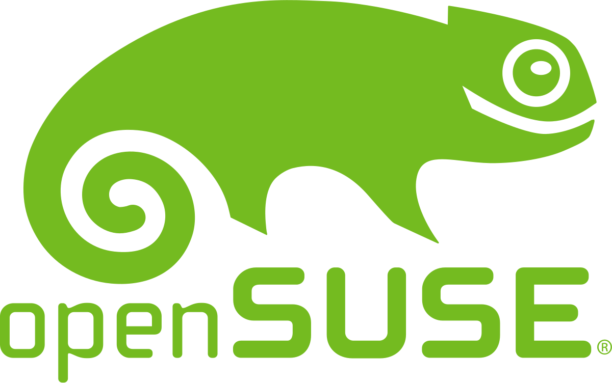

---

<!-- header: 'Other Major Distros' -->
# **NixOS (2003)**
- Deklarative Konfiguration (=> einfach reproduzierbar)
- Einfache Rollbacks
- Package manager: **nix**
- Innovativer Ansatz für Paketmanagement und Updates

---

<!-- header: 'Other Major Distros' -->
# **Gentoo (2000)**
- Quellcodebasierte Distribution
- Extrem anpassbar
- Nutzer kompiliert Pakete selbst (Performance-Optimierung)
- Package manager: **Portage**

---

<!-- header: 'Android-Based' -->
# **Android-Based Distributions**
- GrapheneOS
- LineageOS
- ChromeOS
- ...

---

<!-- header: 'Fun Distros' -->
## **Red Star OS**
- Nordkoreanisches Linux
- UNSERE DATEN

## **TempleOS**
- Von Terry A. Davis entwickelt
- Heilig

## **UwUntu**
- UwU

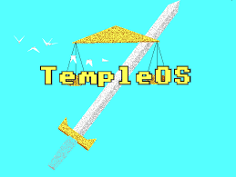

---

<!-- header: 'Distro wählen' -->

## **Faktoren:**
- LTS-Release <---> Rolling Release
- Bloated <---> Blank Slate
- Security <---> Convenience
- In Control <---> Delegation

- Skill level

---

<!-- header: '' -->

# GENTOO - DEMO

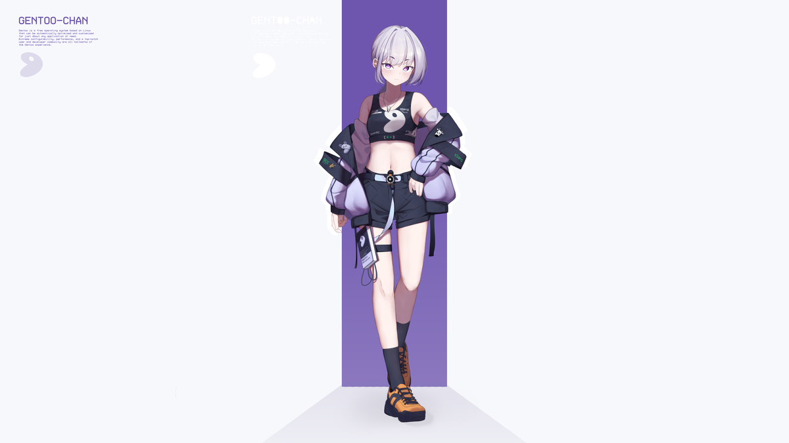

---

# I use gento btw.
