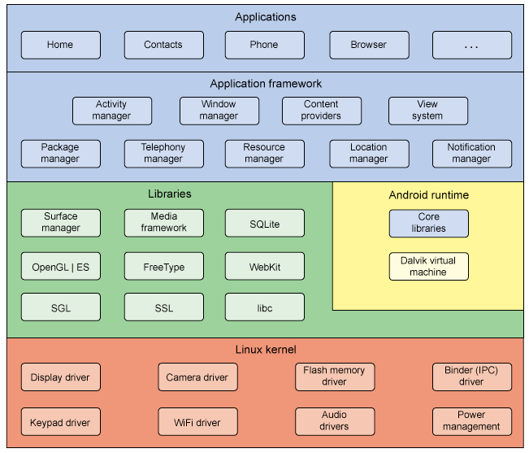

<!-- _class: title -->

# Linux Distributions
## Expedition into the linux distro jungle


---


---


---

# **Was ist eine Distribution?**

---


---

<!-- header: 'Was ist eine Distribution?' -->

- Linux Geschmacksrichtung
- Kernel Gemeinsam
- Der Rest ist austauschbar
- Fokus: user-friendly, user-centric, commercial


<!-- Maßgenschneiderte version von linux - sammlung von packeten + configs-->

---

<!-- header: 'Package Managers' -->

- Package managers
  - dpkg
  - Pacman
  - Portage
  - Nix package manager
  - Snap
  - ...

- Repositories


---

<!-- header: '' -->



---

<!-- header: 'Debian-Based' -->

# **Debian (1993)**
  - Package manager: **dpkg** (APT)
  - Sehr stabil
  - 2GB / 10 GB (Desktop/!Desktop)


---

<!-- header: 'Debian-Based' -->
# **Ubuntu (2004)**
- Einsteigerfreundlich
- Desktop / Server / Core
- Package manager: **dpkg** (APT), Snap


---

<!-- header: 'Arch-Based' -->
# **Arch Linux (2002)**
- Rolling Release: Immer aktuell
- Minimalistische Distro
- Package manager: **pacman** (AUR)
- Alles wird selbst installiert und konfiguriert


---

<!-- header: 'Arch-Based' -->
# **EndeavourOS (2019)**
- Komfortabler Installer
- Minimalistische Distro
- Package manager: **pacman** (AUR)
- Community-driven


---

<!-- header: 'Arch-Based' -->
# **SteamOS**
- Fokus: **Gaming**
- Entwickelt von Valve
- Steam Deck


---

<!-- header: '' -->
# **Linux vs Windows tested in 10 games - Linux 17% faster on Average**
[source](https://video.hardlimit.com/w/uZGK12oU5FeSsy8CDLP4hD)


---

<!-- header: 'Fedora' -->
# **Fedora (2003)**
- Gesponsert von Red Hat
- Sehr aktuell, experimentell
- Package manager: **dnf**
- Fokus: Entwickler und neue Technologien


---

<!-- header: 'OpenSUSE' -->
# **OpenSUSE (2005)**
- Cooles logo
- Packages werden gut durchgetestet
- Konfigurationswerkzeug: **YaST**
- Package manager: **zypper**


---

<!-- header: 'NixOS' -->
# **NixOS (2003)**
- Deklarative Konfiguration (=> Einfach reproduzierbar)
- Einfache Rollbacks
- Package manager: **nix**


---

<!-- header: 'NixOS Network Configuration' -->

```
{...}: {
  services.avahi = {
    enable = true;
    nssmdns4 = true;
    openFirewall = true;
    publish = {
      enable = true;
      addresses = true;
      domain = true;
      hinfo = true;
      userServices = true;
      workstation = true;
    };
  };

  networking = {
    networkmanager.enable = true;
    firewall.enable = true;
  };

  services.mullvad-vpn.enable = true;

  programs.ssh.startAgent = true;

  hardware.bluetooth = {
    enable = true;
    powerOnBoot = true;
    settings = {
      General = {
        Enable = "Source,Sink,Media,Socket";
      };
    };
  };
}
```

---

<!-- header: 'Gentoo' -->
# **Gentoo (2000)**
- Source-Based Distro
- Extrem anpassbar
- Nutzer kompiliert Pakete selbst (Performance-Optimierung)
- Package manager: **Portage**


---

<!-- header: 'Gentoo make.conf example' -->
```
COMMON_FLAGS="-march=native -O2 -pipe"

USE="wayland -X iptables dist-kernel zsh-completion networkmanager vaapi \
     dbus -elogind pipewire alsa -kde -qt3 -qt4 -qt3support tray"

MAKEOPTS="--jobs 8 --load-average 9"

CFLAGS="${COMMON_FLAGS}"
CXXFLAGS="${COMMON_FLAGS}"
FCFLAGS="${COMMON_FLAGS}"
FFLAGS="${COMMON_FLAGS}"

L10N="de en en-GB en-US"

VIDEO_CARDS="intel nvidia"

LC_MESSAGES=C.utf8

ACCEPT_KEYWORDS="~amd64"
```

---

<!-- header: 'Android-Based' -->
# **Android-Based Distributions**
- GrapheneOS
- LineageOS
- ChromeOS
- ...


---

<!-- header: 'Fun Distros' -->
## **Red Star OS**
- Nordkoreanisches Linux
- UNSERE DATEN

## **TempleOS**
- Von Terry A. Davis entwickelt
- Heilig

## **UwUntu**
- UwU


---

<!-- header: 'Distro wählen' -->

## **Faktoren:**
- LTS-Release <---> Rolling Release
- Bloated <---> Minimal
- Security <---> Convenience
- Control <---> Guided

- Skill level

---

<!-- header: '' -->

# GENTOO - DEMO


---

# I use gentoo btw.
